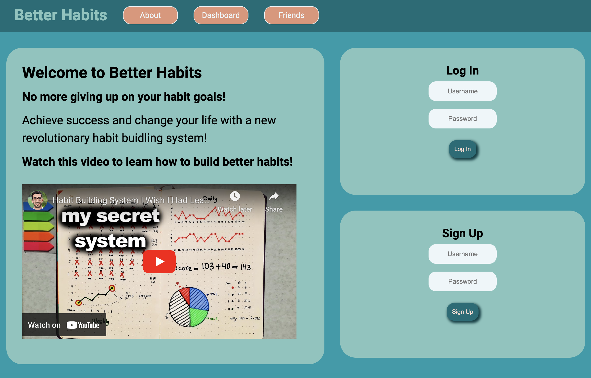

# Better-Habits

The Better-Habits project aims to provide users with a platform to develop better habits and track their progress. It utilizes a client-server architecture, with the client-side built using React and the server-side implemented using Express.js and MongoDB.

The application allows users to create new habits, set levels, define alternatives, and receive feedback and scores based on their progress. The dashboard provides an overview of the user's habits and scores, allowing them to track their performance over time.  



With Better Habits, users can:

1. Sign up for a new account or log in to an existing account.
2. Navigate to the dashboard to view your habits and scores.
3. Create new habits and track your progress.
4. Interact with the habits to update scores and receive feedback.
5. Explore other features of the application, such as the about page and navigation menu.


## Table of Contents
[Installation](#installation)  
[Scripts](#scripts)  
[Tech Stack](#tech-stack)  
[File Structure](#file-structure)


## Installation

To run the Better-Habits application locally, follow these steps:

1. Clone the repository:
  ```bash
  git clone https://github.com/your-username/better-habits.git
  ```
2. Navigate to the project directory: 
  ```bash
  cd better-habits
  ```
3. Install the dependencies: 
  ```bash
  npm install
  ```
4. Start the client and server concurrently: 
  ```bash
  npm run dev
  ```
5. Open your web browser and visit `http://localhost:3000` to view the application.

## Scripts

In the project directory, you can run the following scripts:

- `npm start`: Starts the server with nodemon
- `npm run build`: Builds the client-side application for production deployment.
- `npm run dev`: Runs the server with nodemon and client concurrently

## File Structure

The file structure of the Better-Habits project is organized as follows:

```
.
├── LICENSE
├── README.md
├── client
│   ├── App.jsx
│   ├── components
│   │   ├── About.jsx
│   │   ├── DashboardContainer.jsx
│   │   ├── HabitPost.jsx
│   │   ├── Home.jsx
│   │   ├── Login.jsx
│   │   ├── Navbar.jsx
│   │   ├── Sidebar.jsx
│   │   └── Signup.jsx
│   ├── index.html
│   ├── index.js
│   └── stylesheets
│       ├── _about.scss
│       ├── _dashboardContainer.scss
│       ├── _habitpost.scss
│       ├── _home.scss
│       ├── _login.scss
│       ├── _navbar.scss
│       ├── _sidebar.scss
│       ├── _signup.scss
│       ├── _styles.scss
│       ├── _variables.scss
│       └── application.scss
├── package-lock.json
├── package.json
├── server
│   ├── controllers
│   │   ├── habitController.js
│   │   └── userController.js
│   ├── models
│   │   └── Models.js
│   ├── routes
│   │   ├── habitRouter.js
│   │   └── userRouter.js
│   └── server.js
├── todo.md
└── webpack.config.js
```

The `client` directory contains the client-side code, including the React components and the main entry point (`index.js`).

The `server` directory contains the server-side code, including the server configuration (`server.js`), routes (`userRouter.js` and `habitRouter.js`), models (`Models.js`), and controllers (`habitController.js` and `userController.js`).

